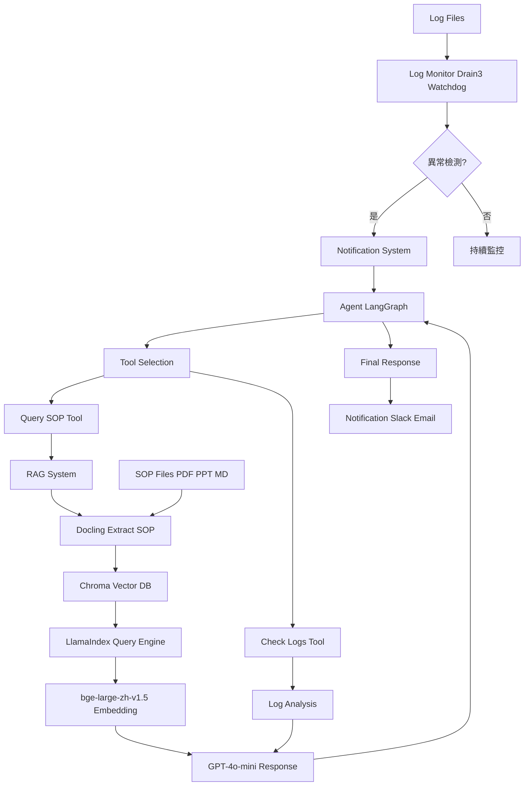

# AutoTest AIOps Agent

智能自動化測試運維代理系統，專為解決測試中斷頻繁、維護成本高、log 異質性及 SOP 存取不便的痛點而設計。

## 專案概述

本專案實現了一個完整的 AIOps 解決方案，整合 log 監控、RAG 知識庫和 LLM Agent，實現測試系統的智能監控和自動容錯。

### 核心功能
- 🔍 **智能 Log 監控**: 使用 Drain3 解析異常模式，Watchdog 即時監控檔案變化
- 📚 **RAG 知識系統**: Docling 提取 SOP 文件，Chroma 向量儲存，LlamaIndex 智慧查詢
- 🤖 **Agent 推理**: LangGraph 建構混合模式 Agent，整合工具調用和 LLM 推理
- 📢 **通知系統**: Slack 和 Email 即時警報
- 🚀 **DevOps 就緒**: Docker 容器化，CI/CD 管道，性能監控

## 系統架構



### 架構說明

#### 1. 資料輸入層
- **Log Files**: 測試系統產生的應用日誌
- **SOP Files**: 標準操作程序文件（PDF、PPT、Markdown格式）

#### 2. 監控層
- **Log Monitor**: 使用 Drain3 進行日誌模板挖掘和異常檢測，Watchdog 監控檔案變化
- **Notification System**: 當檢測到異常時，立即發送 Slack 和 Email 通知

#### 3. 處理層
- **Agent (LangGraph)**: 混合模式 Agent，負責協調工具調用和推理流程
  - **Tool Selection**: 根據異常情況選擇適當工具
  - **Query SOP Tool**: 查詢相關 SOP 文件
  - **Check Logs Tool**: 分析日誌模式

#### 4. 知識層
- **RAG System**: 檢索增強生成系統
  - **Docling**: 提取 SOP 文件內容
  - **Chroma**: 向量資料庫儲存嵌入
  - **LlamaIndex**: 建構查詢引擎
  - **bge-large-zh-v1.5**: 中文嵌入模型
  - **GPT-4o-mini**: LLM 生成回應

#### 5. 輸出層
- **Final Response**: Agent 生成的解決建議
- **Notification**: 最終通知發送到指定渠道

## 技術堆疊

- **程式語言**: Python 3.11+
- **框架**: LangChain/LangGraph, LlamaIndex
- **AI 模型**: GPT-4o-mini (via OpenRouter), bge-large-zh-v1.5
- **資料庫**: Chroma (向量), SQLite (Drain3 狀態)
- **部署**: Docker, GitHub Actions CI/CD
- **測試**: pytest

## 安裝與設定

### 環境需求
- Python 3.11+
- pip
- Docker (可選，用於部署)

### 安裝步驟

1. **複製專案**
   ```bash
   git clone <repository-url>
   cd autotest-aiops-agent
   ```

2. **設定虛擬環境**
   ```bash
   python -m venv venv
   source venv/bin/activate  # Linux/Mac
   # 或
   venv\Scripts\activate     # Windows
   ```

3. **安裝依賴**
   ```bash
   pip install -e .
   ```

4. **設定環境變數**
   編輯 `.env` 文件：
   ```
   OPENROUTER_API_KEY=你的 OpenRouter API key
   SLACK_BOT_TOKEN=你的 Slack bot token (可選)
   EMAIL_SMTP_SERVER=smtp.gmail.com (可選)
   EMAIL_USER=你的 email (可選)
   EMAIL_PASS=你的 email 密碼 (可選)
   ```

## 使用方法

### 運行演示
```bash
python demo.py
```

演示會：
1. 創建假的 SOP 文件和 log
2. 初始化 RAG 系統
3. 啟動 log 監控
4. 模擬異常檢測
5. Agent 處理異常並查詢 SOP
6. 顯示完整推理過程

### 運行測試
```bash
pytest
```

### Docker 部署
```bash
docker-compose up -d
```

## 專案結構

```
autotest-aiops-agent/
├── agent/                    # 核心代理模組
│   ├── __init__.py
│   ├── agent.py             # LangGraph Agent 實現
│   ├── monitor.py           # Log 監控模組
│   ├── rag.py               # RAG 系統
│   ├── notification.py      # 通知系統
│   └── metrics.py           # 性能監控
├── tests/                   # 測試文件
│   ├── test_agent.py
│   ├── test_monitor.py
│   ├── test_rag.py
│   └── test_integration.py
├── data/                    # 資料目錄
├── docs/                    # 文件
├── logs/                    # 日誌檔案
├── sop/                     # SOP 文件
├── .env                     # 環境變數
├── demo.py                  # 演示腳本
├── Dockerfile               # Docker 配置
├── docker-compose.yml       # Docker Compose
├── pyproject.toml           # 專案配置
└── README.md               # 本文件
```

## 開發歷程

### 階段 1: 準備與設計
- 設定專案目錄結構
- 初始化 Python 專案和依賴
- 設計 Agent 架構

### 階段 2: 核心開發
- 實現 log 監控模組 (Drain3 + Watchdog)
- 建構 RAG 系統 (Docling + Chroma + LlamaIndex)
- 開發 Agent 邏輯 (LangGraph + OpenRouter)
- LLM 調優和參數調整

### 階段 3: 整合與測試
- 整合所有組件
- 撰寫單元測試和整合測試
- 設定通知系統 (Slack + Email)

### 階段 4: 部署與優化
- Docker 容器化
- GitHub Actions CI/CD 管道
- 性能監控和優化
- 生產環境部署準備

## API 說明

### Log Monitor
```python
from agent.monitor import LogMonitor

monitor = LogMonitor(log_file="logs/application.log")
monitor.start_monitoring()
```

### RAG System
```python
from agent.rag import RAGSystem

rag = RAGSystem()
rag.load_documents("sop/")
response = rag.query("資料庫連接失敗怎麼辦？")
```

### Agent
```python
from agent.agent import agent

result = agent.invoke({"messages": [{"role": "user", "content": "系統異常"}]})
```

## 貢獻指南

1. Fork 專案
2. 建立功能分支 (`git checkout -b feature/AmazingFeature`)
3. 提交更改 (`git commit -m 'Add some AmazingFeature'`)
4. 推送到分支 (`git push origin feature/AmazingFeature`)
5. 開啟 Pull Request

## 授權

本專案採用 MIT 授權 - 詳見 [LICENSE](LICENSE) 文件

## 聯絡資訊

專案維護者 - [您的聯絡方式]

專案連結: [GitHub Repository]