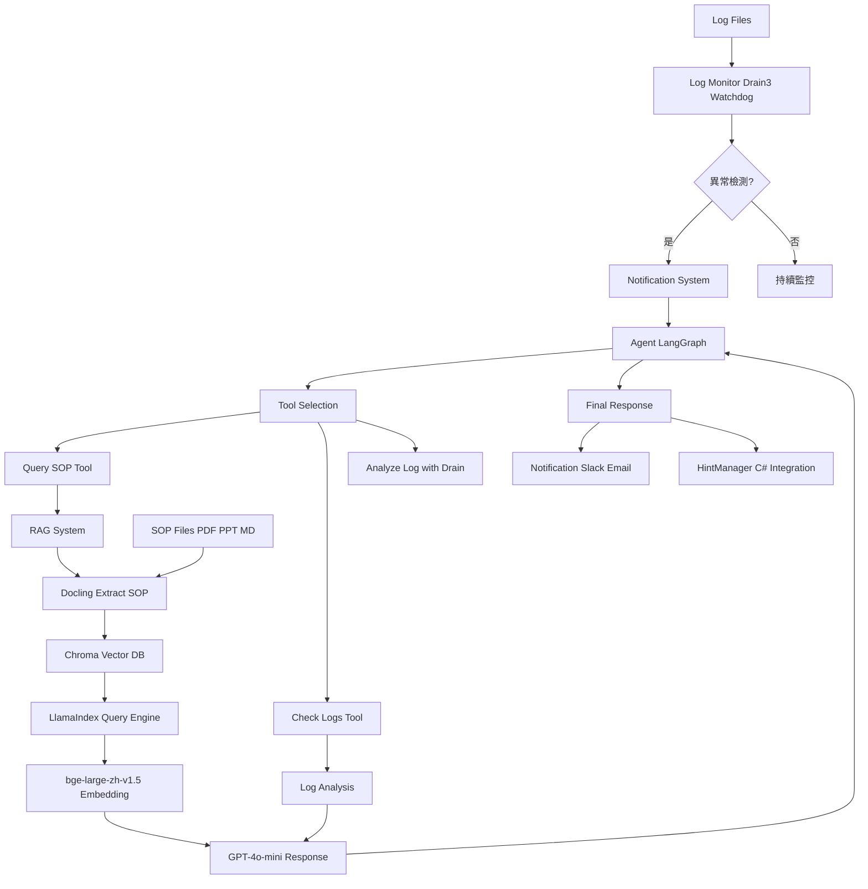

# AutoTest AIOps Agent

智能自動化測試運維代理系統，專為解決測試中斷頻繁、維護成本高、log 異質性及 SOP 存取不便的痛點而設計。

## 專案概述

本專案實現了一個完整的 AIOps 解決方案，整合 log 監控、RAG 知識庫和 LLM Agent，實現測試系統的智能監控和自動容錯。

### 核心功能
- 🔍 **智能 Log 監控**: 使用 Drain3 解析異常模式，Watchdog 即時監控檔案變化
- 📚 **RAG 知識系統**: Docling 提取 SOP 文件，Chroma 向量儲存，LlamaIndex 智慧查詢
- 🤖 **Agent 推理**: LangGraph 建構混合模式 Agent，整合工具調用和 LLM 推理
- 📢 **通知系統**: Slack 和 Email 即時警報
- 🏭 **多實驗室支援**: 單一 API Server 支援多個實驗室，資料隔離
- 🚀 **DevOps 就緒**: Docker 容器化，CI/CD 管道，FastAPI REST API

## 系統架構

```
┌─────────────────────────────────────────────────────────────────────────────┐
│                         多實驗室 AIOps Agent 架構                            │
└─────────────────────────────────────────────────────────────────────────────┘

                              ┌─────────────────────┐
                              │   API Server :8000  │
                              │   (FastAPI)         │
                              └──────────┬──────────┘
                                         │
        ┌────────────────────────────────┼────────────────────────────────┐
        │                                │                                │
        ▼                                ▼                                ▼
  ┌───────────┐                    ┌───────────┐                    ┌───────────┐
  │   lab1    │                    │   lab2    │                    │   lab3    │  ...
  │           │                    │           │                    │           │
  │ • RAG     │                    │ • RAG     │                    │ • RAG     │
  │ • Agent   │                    │ • Agent   │                    │ • Agent   │
  │ • Monitor │                    │ • Monitor │                    │ • Monitor │
  └─────┬─────┘                    └─────┬─────┘                    └─────┬─────┘
        │                                │                                │
        ▼                                ▼                                ▼
  ┌───────────┐                    ┌───────────┐                    ┌───────────┐
  │sop/lab1/  │                    │sop/lab2/  │                    │sop/lab3/  │
  │ *.pdf     │                    │ *.pdf     │                    │ *.pdf     │
  └───────────┘                    └───────────┘                    └───────────┘
        │                                │                                │
        └────────────────────────────────┼────────────────────────────────┘
                                         ▼
                              ┌─────────────────────┐
                              │      ChromaDB       │
                              │  (共享向量庫)        │
                              │  Collection 隔離    │
                              └─────────────────────┘
```

### 資料流程



## 技術堆疊

| 類別 | 技術 |
|------|------|
| **程式語言** | Python 3.11+ |
| **API 框架** | FastAPI, Uvicorn |
| **Agent 框架** | LangChain, LangGraph |
| **RAG 框架** | LlamaIndex, Docling |
| **AI 模型** | GPT-4o-mini (OpenRouter), bge-large-zh-v1.5 |
| **向量資料庫** | ChromaDB |
| **Log 分析** | Drain3 |
| **部署** | Docker, Docker Compose |
| **CI/CD** | GitHub Actions |
| **測試** | pytest |

## 安裝與設定

### 環境需求
- Python 3.11+
- pip
- Docker (可選，用於部署)

### 安裝步驟

1. **複製專案**
   ```bash
   git clone <repository-url>
   cd autotest-aiops-agent
   ```

2. **設定虛擬環境**
   ```bash
   python -m venv venv
   source venv/bin/activate  # Linux/Mac
   # 或
   venv\Scripts\activate     # Windows
   ```

3. **安裝依賴**
   ```bash
   pip install -e .
   ```

4. **設定環境變數**

   建立 `.env` 文件：
   ```bash
   # 必要
   OPENROUTER_API_KEY=你的_OpenRouter_API_key

   # 可選 - 多實驗室配置
   LAB_ID=default
   ALLOWED_LABS=lab1,lab2,lab3,lab4,lab5

   # 可選 - 通知
   SLACK_BOT_TOKEN=你的_Slack_bot_token
   SLACK_CHANNEL=#alerts
   EMAIL_SERVER=smtp.gmail.com
   EMAIL_PORT=587
   EMAIL_USER=你的_email
   EMAIL_PASSWORD=你的_email_密碼
   EMAIL_TO=接收者_email
   ```

## 使用方法

### 方式一：API Server（多實驗室）

```bash
# 1. 建立各實驗室 SOP 目錄
mkdir -p sop/{lab1,lab2,lab3,lab4,lab5}

# 2. 放入 SOP 文件
cp your_sop.pdf sop/lab1/

# 3. 啟動 API Server
uvicorn agent.api_server:app --host 0.0.0.0 --port 8000

# 4. 查詢 SOP
curl -X POST http://localhost:8000/query \
  -H "Content-Type: application/json" \
  -d '{"query": "如何處理連線逾時?", "lab_id": "lab1"}'
```

### 方式二：單機模式

```bash
# 運行演示
python demo.py

# 運行測試
pytest -v
```

### 方式三：Docker 部署

```bash
# 多實驗室 API Server
docker-compose up api-server

# 單實驗室模式
docker-compose --profile single-lab up
```

## API 端點

| 端點 | 方法 | 說明 |
|------|------|------|
| `/` | GET | API 資訊 |
| `/health` | GET | 健康檢查 |
| `/labs` | GET | 列出所有實驗室 |
| `/labs/{lab_id}/status` | GET | 實驗室狀態 |
| `/query` | POST | 查詢 SOP 文件 |
| `/analyze` | POST | 分析日誌異常 |
| `/chat` | POST | 與 Agent 對話 |
| `/labs/{lab_id}/rebuild-index` | POST | 重建 RAG 索引 |

### API 使用範例

```bash
# 查詢 SOP
curl -X POST http://localhost:8000/query \
  -H "Content-Type: application/json" \
  -d '{"query": "How to handle connection timeout?", "lab_id": "lab1"}'

# 分析日誌
curl -X POST http://localhost:8000/analyze \
  -H "Content-Type: application/json" \
  -d '{"log_content": "ERROR: Connection timeout at 10:00:00", "lab_id": "lab1"}'

# 查看實驗室狀態
curl http://localhost:8000/labs/lab1/status
```

## 專案結構

```
autotest-aiops-agent/
├── agent/                    # 核心代理模組
│   ├── __init__.py
│   ├── agent.py             # LangGraph Agent (多實驗室支援)
│   ├── api_server.py        # FastAPI 多實驗室 API Server
│   ├── config.py            # 配置管理 (Lab/Agent/Monitor)
│   ├── hint_manager.py      # C# 測試框架整合
│   ├── monitor.py           # Log 監控模組 (Drain3 + Watchdog)
│   ├── rag.py               # RAG 系統 (多實驗室 Collection)
│   ├── notification.py      # 通知系統 (Slack + Email)
│   └── metrics.py           # 性能監控
├── tests/                   # 測試文件
│   ├── test_agent.py
│   ├── test_monitor.py
│   ├── test_rag.py
│   ├── test_integration.py
│   └── test_integration_csharp.py
├── sop/                     # SOP 文件 (按實驗室分目錄)
│   ├── lab1/
│   ├── lab2/
│   └── ...
├── logs/                    # 日誌檔案
├── hints/                   # C# 整合提示檔
├── chroma_db/               # 向量資料庫 (自動生成)
├── plans/                   # 架構規劃文件
├── .env                     # 環境變數 (不納入版控)
├── demo.py                  # 演示腳本
├── Dockerfile               # Docker 配置
├── docker-compose.yml       # Docker Compose (含 API Server)
├── pyproject.toml           # 專案配置
├── CLAUDE.md                # Claude Code 專案指引
└── README.md                # 本文件
```

## 配置說明

### LabConfig (實驗室配置)
```python
lab_id: str          # 實驗室 ID
sop_dir: str         # SOP 文件目錄
log_dir: str         # 日誌目錄
hints_dir: str       # C# 整合目錄
chroma_db_dir: str   # 向量庫路徑
```

### AgentConfig (Agent 配置)
```python
llm_model: str = "gpt-4o-mini"
temperature: float = 0.3
max_tokens: int = 1000
embedding_model: str = "BAAI/bge-large-zh-v1.5"
```

### MonitorConfig (監控配置)
```python
auto_process: bool = False       # 自動觸發 Agent
notification_cooldown: int = 300  # 通知冷卻時間 (秒)
crash_timeout: int = 30          # 心跳超時 (秒)
```

## Python API

### 多實驗室 Agent
```python
from agent.agent import build_agent, get_rag_system

# 取得特定實驗室的 Agent
agent = build_agent(lab_id="lab1")
result = agent.invoke({"messages": [{"role": "user", "content": "系統異常怎麼辦?"}]})

# 取得特定實驗室的 RAG
rag = get_rag_system(lab_id="lab2")
response = rag.query("如何設定相機?")
```

### Log Monitor
```python
from agent.monitor import LogMonitor

monitor = LogMonitor(log_dir="logs/lab1", auto_process=True)
monitor.start()
```

## 開發歷程

### Phase 1: 基礎架構
- Log 監控模組 (Drain3 + Watchdog)
- RAG 系統 (Docling + Chroma + LlamaIndex)
- Agent 邏輯 (LangGraph + OpenRouter)

### Phase 2: 整合與測試
- 通知系統 (Slack + Email)
- 單元測試和整合測試
- Docker 容器化

### Phase 3: 多實驗室擴展
- 配置管理模組 (config.py)
- Per-lab 實例快取
- FastAPI REST API Server
- C# 測試框架整合 (HintManager)

## 貢獻指南

1. Fork 專案
2. 建立功能分支 (`git checkout -b feature/AmazingFeature`)
3. 提交更改 (`git commit -m 'Add some AmazingFeature'`)
4. 推送到分支 (`git push origin feature/AmazingFeature`)
5. 開啟 Pull Request

## 授權

本專案採用 MIT 授權 - 詳見 [LICENSE](LICENSE) 文件
